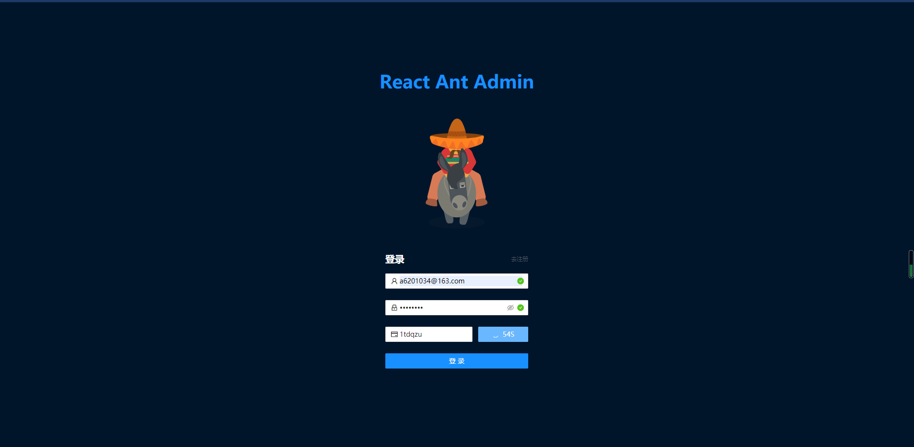
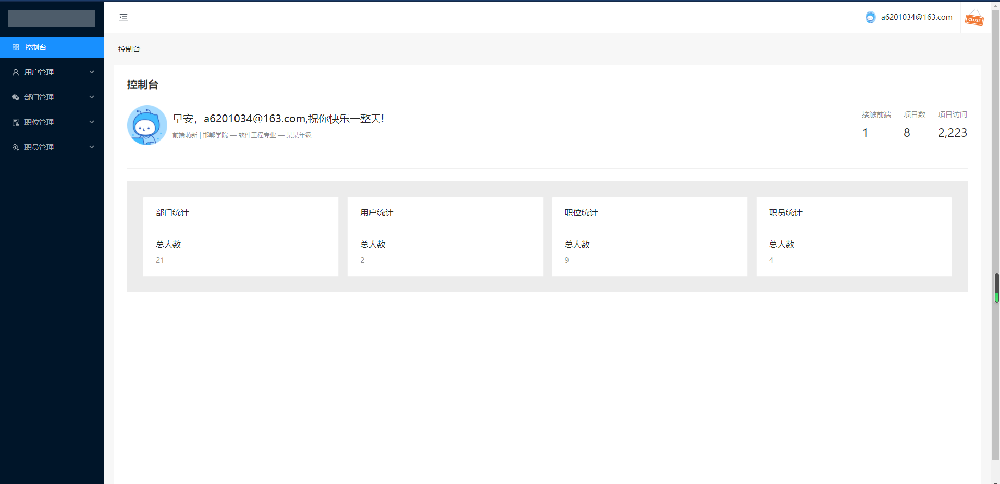
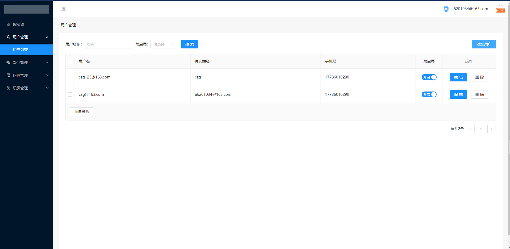
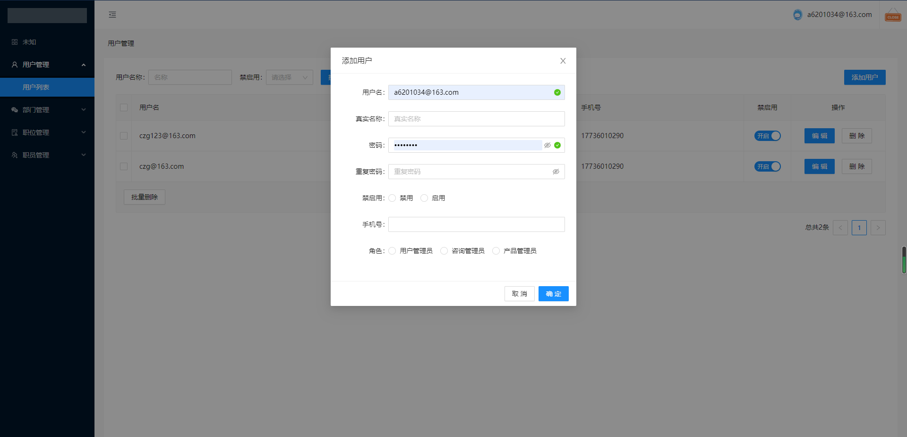
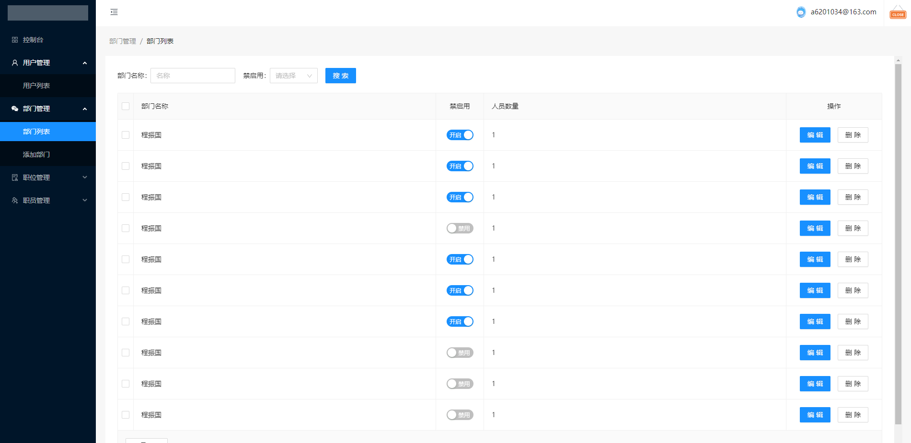
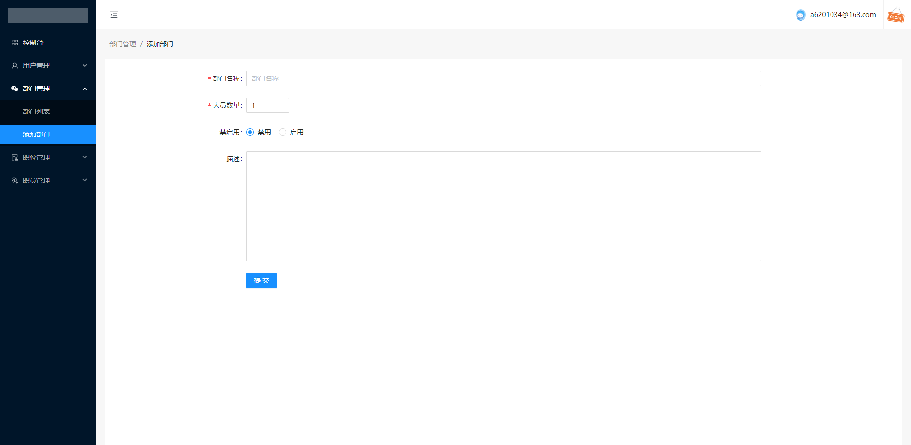
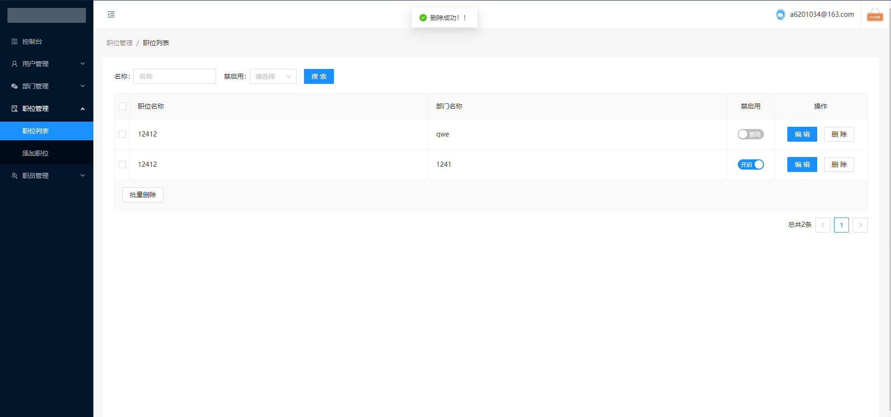
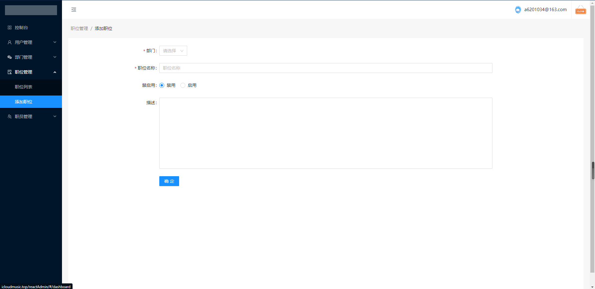
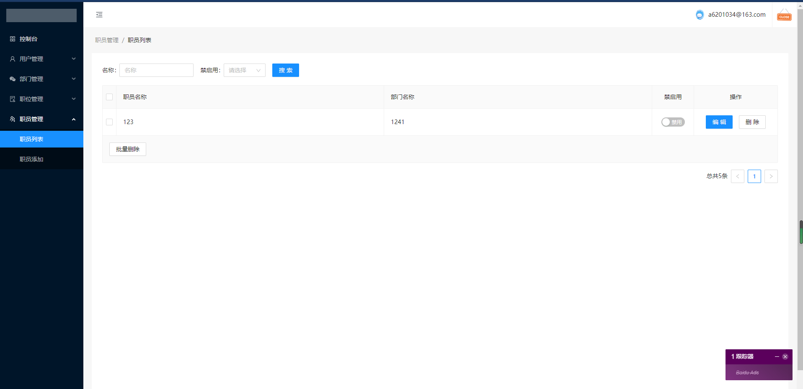
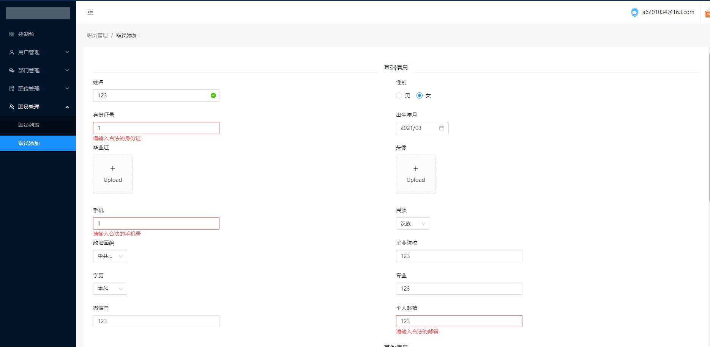

# React Admin

React Admin——一个基于React、TypeScript、Vite的编写的管理系统。

## 项目体验地址

http://icloudmusic.top/reactAdmin

## 功能列表

- 登录/注册

  控制台

  -  基础信息
  -  人数统计 

- 用户管理

  -  添加用户
  -  编辑用户
  -  分配角色

- 部门管理

  -  部门列表
  -  添加部门

- 职位管理

  -  职位列表
  -  添加职位

- 职员管理

  -  职员列表
  -  职员添加

- 权限功能

  -  根据用户角色权限生成路由以及侧边栏导航
  -  根据权限来校验组件渲染

## 技术栈

- React，使用Redux做状态管理。
- Hook，react-use库（很方便）。
- TypeScript。
- antd 组件库。
- Less。
- Vite。
- Eslint做代码检查。

## 图片预览

## API接口

[api (web-jshtml.cn)](http://www.web-jshtml.cn/file/reactApi.html)
